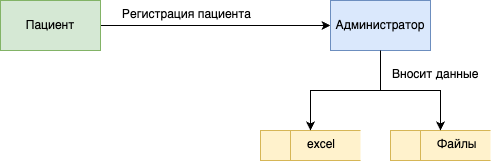
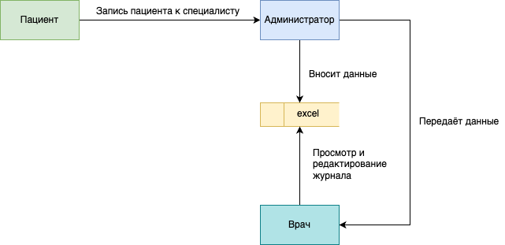
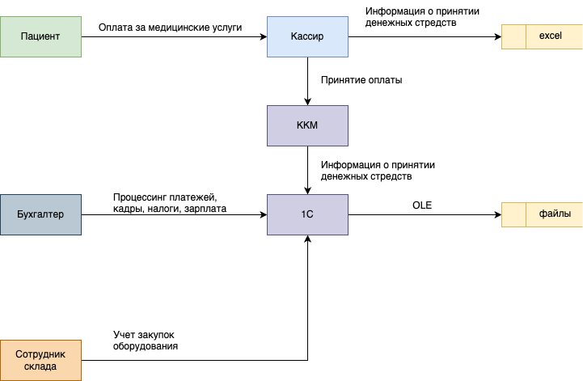
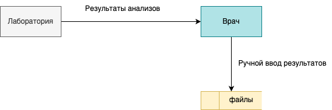
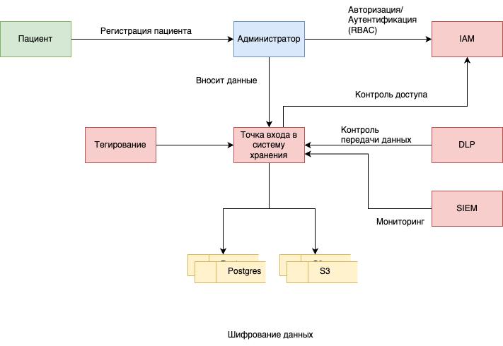
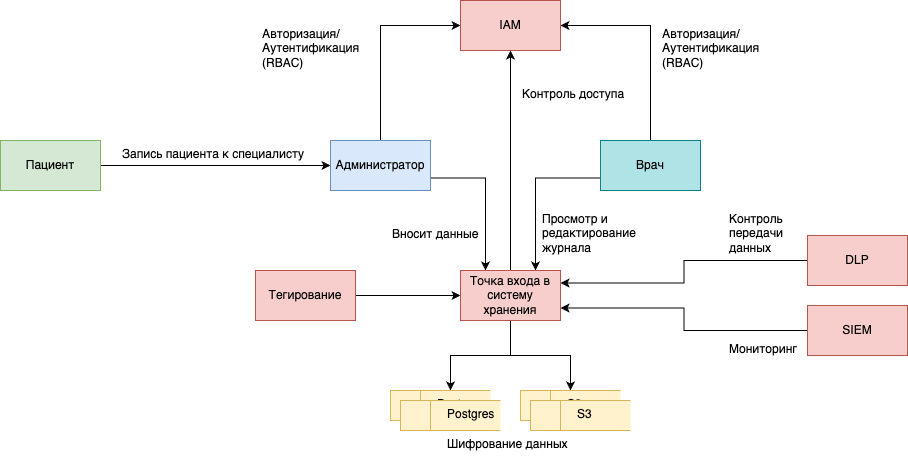
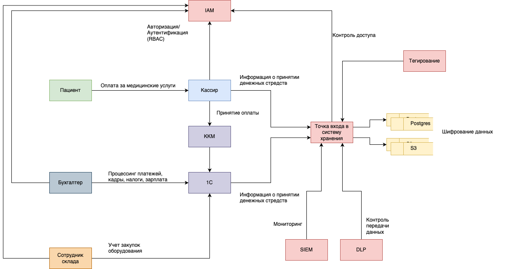
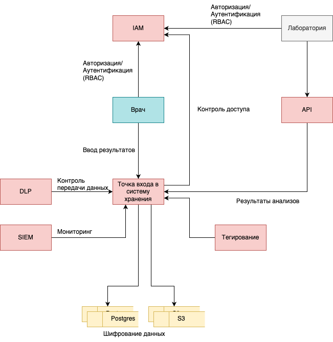

# Задание 1

## 1. Выявите конфиденциальные данные, которые не учтены во внутренних системах.

## Data Flow Diagrams (DFD)

[Исходники drawio по страницам](./src/project10-landscape.drawio)

### Регистрация пациента

### Запись к специалисту

### Оплата и закупки

### Обработка анализов

## Чувствительные данные

 - Персональные данные (PII): ФИО, дата рождения, телефон, email, адрес прописки, место работы/учёбы.
 - Медицинские данные: история болезней, диагнозы, результаты анализов, назначения врачей.
 - Финансовые данные: платежи, договоры, платежные реквизиты.
 - Учётные данные сотрудников: логины, пароли, доступы к системам.

## Текущие проблемы хранения и обработки

 - Данные хранятся в Excel, PDF, JPG без разграничения доступа.
 - Нет аудита действий с данными.
 - Передача данных между системами не защищена.
 - Нет классификации данных по уровню конфиденциальности.

## 2. Проведите аудит мер по обеспечению безопасности данных. 

Аудит мер безопасности и выявление проблемных зон в отдельном документе:

 - [Аудит мер безопасности и выявление проблемных зон](./security_audit.md)

## 3. Подумайте, что можно улучшить.

## Рекомендации по улучшению безопасности данных

#### Защита данных

PII (ФИО, телефон):
 - Методы: Маскирование
 - Инструменты: Hashicorp Vault

Медицинские данные:
 - Методы: Шифрование (при передаче и в состоянии покоя)
 - Инструменты: PostgreSQL + pgcrypto, TLS

Финансовые данные:
 - Методы: Маскирование
 - Инструменты: 1С (настройка прав доступа)

Учётные данные
 - Методы: MFA, RBAC
 - Инструменты: Keycloak, Active Directory

#### Тегирование данных

 - Внедрение меток конфиденциальности (например PII, Medical, Accounting, Other).
 - Использование Data Loss Prevention (DLP) для превентивного контроля утечки данных (например, Symantec DLP).
 - Интеграция тегов в SIEM (Splunk, ELK) для мониторинга аномалий.

### DFD с мерами защиты

 - Шифрование всех медицинских данных в хранилище (PostgreSQL, S3)
 - API-шлюз для интеграции с лабораторией (TLS + аутентификация OAuth2)
 - Ролевая модель (RBAC):
   - Врачи - доступ только к своим пациентам
   - Кассиры - только финансовые данные
 - DLP и SIEM для мониторинга утечек
 - Тегирование данных (например, с помощью Apache Atlas)

### Регистрация пациента

[Исходники drawio по страницам](./src/project10-landscape.drawio)

### Запись к специалисту

### Оплата и закупки

### Обработка анализов

